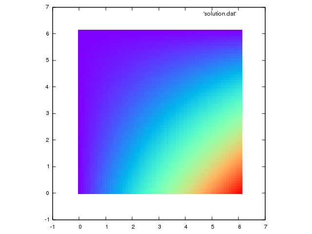

# MIDTERM EVALUATION
## Background

Please refer to [background.md](./aux/background.md)

## Makefile
- `make` to compile
- `make run` to compile and run
- `make plot` to see the solution using *gnuplot*
- `make clean` to clean up

## Exercises
1. Parallelize and optimize `jacobi.c` according to [**these suggestions**](./aux/hints.md)
2. Perform a performance analysis of the code scaling (matrix size 1024 and 4096)
3. Write a report explaning what you have done and what you have understood. Push it on the master branch of your fork!

## Reference result (matrix size 60, 2000 iterations)

	

